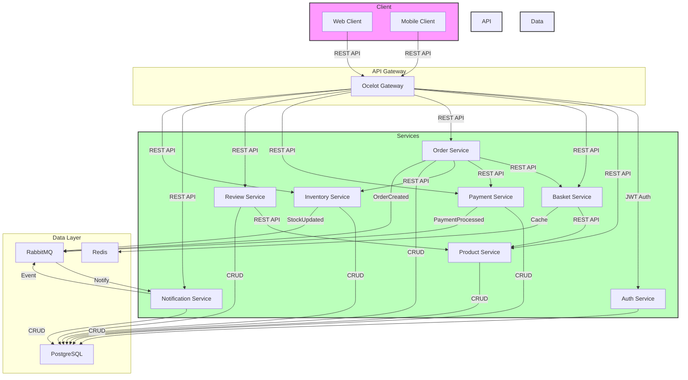

# 8Service E-Commerce Microservices Architecture

## 📋 Project Overview

This project represents a modern e-commerce platform developed with a microservices architecture. Each service can operate independently and has its own database.

## 🏗️ Architecture



## 🛠️ Technologies

- **Backend**: .NET Core
- **Database**: PostgreSQL
- **Messaging**: RabbitMQ
- **Caching**: Redis
- **API Gateway**: Ocelot
- **Authentication**: JWT
- **Docker & Docker Compose**

## 📦 Services

### 1. Auth Service
- User registration and login
- JWT token management
- Role-based authorization

### 2. Product Service
- Product management
- Category operations
- Product search and filtering

### 3. Basket Service
- Shopping cart operations
- Redis cache integration
- Product stock control

### 4. Order Service
- Order creation and management
- Order status tracking
- Order history

### 5. Payment Service
- Payment processing
- Payment status tracking
- Multiple payment method support

### 6. Review Service
- Product reviews
- Rating system
- Comment management

### 7. Notification Service
- Email notifications
- SMS notifications
- Notification preferences

### 8. Inventory Service
- Stock management
- Warehouse tracking
- Stock updates

## 🗄️ Database Schema


## 🚀 Getting Started

1. Set up environment variables:
   ```bash
   cp .env.example .env
   ```

2. Start Docker containers:
   ```bash
   docker-compose up -d
   ```

3. Start services in order:
   ```bash
   dotnet run --project AuthService
   dotnet run --project ProductService
   # ... other services
   ```

## 🔐 Security

- JWT-based authentication
- Role-based authorization
- HTTPS mandatory
- Sensitive data encryption

## 📈 Performance

- Redis cache utilization
- Asynchronous messaging
- Load balancing
- Scalable architecture

## 🤝 Contributing

1. Fork the repository
2. Create your feature branch (`git checkout -b feature/amazing-feature`)
3. Commit your changes (`git commit -m 'Add some amazing feature'`)
4. Push to the branch (`git push origin feature/amazing-feature`)
5. Open a Pull Request

## 📝 License

This project is licensed under the MIT License. See the [LICENSE](LICENSE) file for details.
